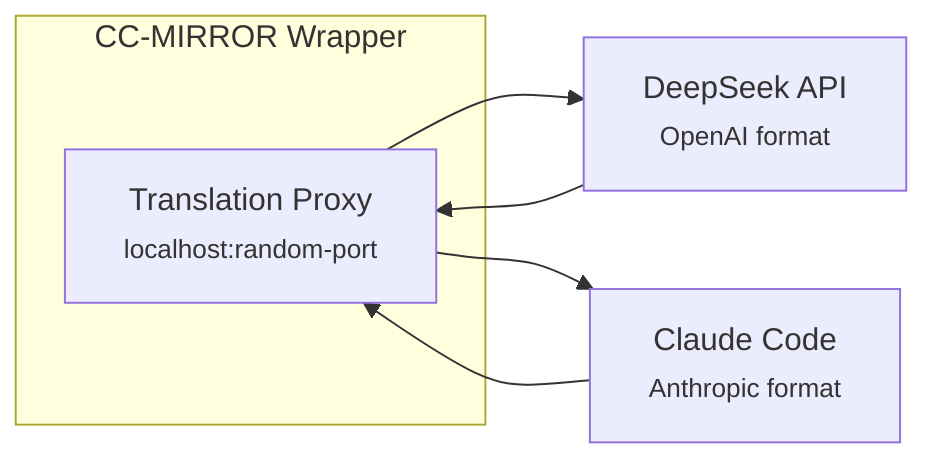
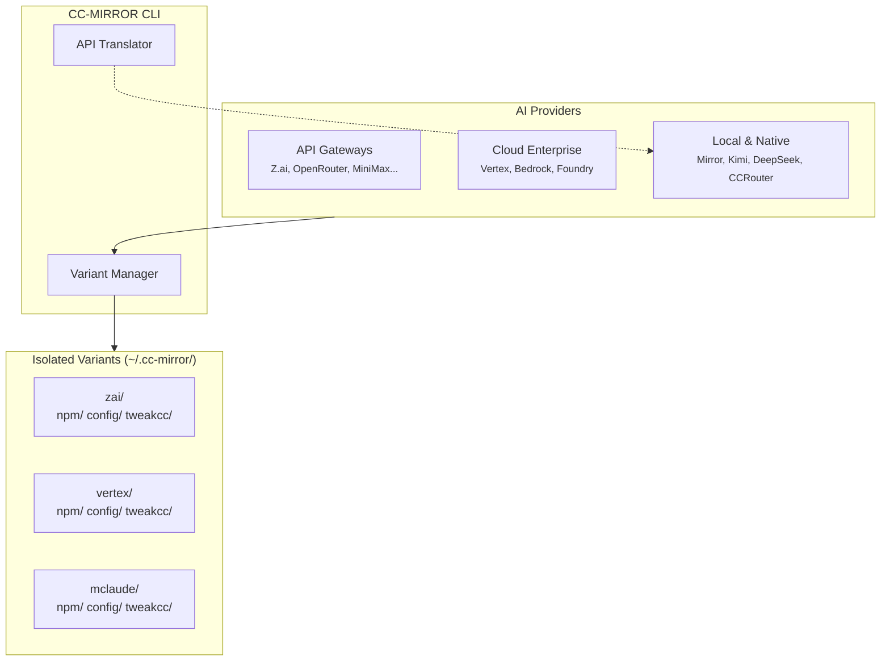

# CC-MIRROR

<p align="center">
  
</p>

<p align="center">
  <a href="https://www.npmjs.com/package/cc-mirror"></a>
  <a href="https://opensource.org/licenses/MIT"></a>
  <a href="https://twitter.com/fase_consulting"></a>
</p>

<p align="center">
  <strong>Run multiple isolated Claude Code instances with different AI providers.</strong>
</p>

<p align="center">
  <code>15 providers</code> · <code>25+ CLI commands</code> · <code>Team mode</code> · <code>MCP registry</code> · <code>API translator</code>
</p>

---

## About This Fork

> **Upstream:** [numman-ali/cc-mirror](https://github.com/numman-ali/cc-mirror)

This fork extends cc-mirror with enterprise tooling and additional providers:

| Addition                 | Description                                                           |
| ------------------------ | --------------------------------------------------------------------- |
| **Cloud Providers**      | Vertex AI (GCP), Bedrock (AWS), Foundry (Azure)                       |
| **Extended Providers**   | Kimi Code, DeepSeek, Ollama, Vercel AI, Poe, GatewayZ, NanoGPT        |
| **API Translator**       | Built-in Anthropic↔OpenAI translation for OpenAI-compatible providers |
| **MCP Management**       | `cc-mirror mcp` commands + MCP server registry with one-click install |
| **Config Export/Import** | Snapshot and restore variant configurations                           |
| **Sync Command**         | Copy configs between variants with diff preview                       |
| **Tasks CLI**            | Full task management + workflow templates                             |
| **Enterprise Tools**     | Backup/restore, cleanup, enhanced doctor, variant templates           |

We maintain compatibility with upstream and contribute improvements back when possible.

### Key Improvements

Notable fixes and optimizations in this fork:

| Change                     | Description                                                                                                                    |
| -------------------------- | ------------------------------------------------------------------------------------------------------------------------------ |
| **Windows Support**        | `.cmd` wrappers, PowerShell profile integration, npm install fixes, automatic user PATH update on variant create/update        |
| **IPv4-first DNS**         | `--prefer-ipv4` flag for Z.ai connectivity issues                                                                              |
| **Ctrl+C Handling**        | Fixed interrupt handling (ESC fallback, double-press exit)                                                                     |
| **Model Tier System**      | Explicit model selection (haiku/sonnet/opus) in orchestration                                                                  |
| **Worker Agent Detection** | Prevents recursive orchestration chaos in spawned agents                                                                       |
| **Task Isolation**         | Project-scoped tasks prevent cross-project pollution                                                                           |
| **Termux/Android**         | Full support with PATH setup automation                                                                                        |
| **Skill Auto-approve**     | Orchestration skill loads without permission prompts                                                                           |
| **Async TUI Updates**      | Live progress bars and step animations                                                                                         |
| **Orchestration Hang Fix** | TaskOutput calls now require timeout to prevent infinite hangs                                                                 |
| **Temp Dir Isolation**     | Per-user temp files via XDG_RUNTIME_DIR/TMPDIR (multi-user safe)                                                               |
| **Compact Mitigation**     | Mirror provider sets `ANTHROPIC_SMALL_FAST_MODEL=claude-haiku-4-5-20251001` to avoid "Conversation too long" compaction errors |

See [CHANGELOG.md](CHANGELOG.md) for complete version history.

---

## Features

### Multi-Provider Support

Connect Claude Code to **16 different AI providers**:

| Provider       | Type    | Models                 | Auth            | Notes                    |
| -------------- | ------- | ---------------------- | --------------- | ------------------------ |
| **Z.ai**       | Gateway | GLM-4.7, GLM-4.5-Air   | API Key         | Heavy coding with GLM    |
| **MiniMax**    | Gateway | MiniMax-M2.1           | API Key         | Unified model experience |
| **OpenRouter** | Gateway | 100+ models            | Auth Token      | Pay-per-use flexibility  |
| **NanoGPT**    | Gateway | 100+ models            | Auth Token      | Multi-model access       |
| **Vercel**     | Gateway | Multi-provider         | Auth Token      | Vercel AI Gateway        |
| **Poe**        | Gateway | Claude via Poe         | Auth Token      | Quora's Poe API          |
| **GatewayZ**   | Gateway | Claude via OneRouter   | Auth Token      | Anthropic via GatewayZ   |
| **Vertex AI**  | Cloud   | Claude (native)        | GCP Auth        | Enterprise GCP           |
| **Bedrock**    | Cloud   | Claude (native)        | AWS Credentials | Enterprise AWS           |
| **Foundry**    | Cloud   | Claude (native)        | Azure Auth      | Enterprise Azure         |
| **Mirror**     | Native  | Claude (native)        | OAuth/Key       | Pure Claude + team mode  |
| **Kimi Code**  | Native  | K2.5                   | API Key         | Moonshot AI coding       |
| **DeepSeek**   | Native  | deepseek-chat/reasoner | API Key         | Uses translator          |
| **Ollama**     | Local   | Any Ollama model       | Optional        | Direct Ollama support    |
| **CCRouter**   | Local   | Ollama, local LLMs     | Optional        | Local-first dev          |

### Team Mode (Multi-Agent Orchestration)

Team mode enables **coordinated multi-agent workflows** with shared task management. This is the same capability that other projects market as "swarm mode".

**Version differences:**

- **Claude Code 2.0.x:** Task tools disabled by default → CC-MIRROR patches `cli.js` to enable
- **Claude Code 2.1.x:** Task tools **enabled by default** → no patch needed, just env configuration

#### What It Unlocks

CC-MIRROR patches Claude Code's CLI to enable these tools:

| Tool         | Purpose                                                    |
| ------------ | ---------------------------------------------------------- |
| `TaskCreate` | Create tasks with subject, description, and dependencies   |
| `TaskGet`    | Retrieve full task details including comments and blockers |
| `TaskUpdate` | Update status, add comments, set blocks/blockedBy          |
| `TaskList`   | List all tasks with filtering by status and owner          |

#### How It Works

```
┌─────────────────────────────────────────────────────────────┐
│  Claude Code CLI contains a feature flag function:          │
│                                                             │
│    function sU(){return!1}  ← disabled (default)            │
│    function sU(){return!0}  ← enabled (after patch)         │
│                                                             │
│  CC-MIRROR patches this automatically when you use          │
│  --enable-team-mode or create a Mirror Claude variant.      │
└─────────────────────────────────────────────────────────────┘
```

#### Usage

```bash
# Enable on any variant
npx cc-mirror quick --provider zai --enable-team-mode

# Mirror Claude has team mode enabled by default
npx cc-mirror quick --provider mirror

# Enable on existing variant
npx cc-mirror update myvariant --enable-team-mode
```

#### Multi-Agent Workflow Example

```
┌──────────────┐
│  Team Lead   │  Creates tasks, sets dependencies
│   (You)      │  Uses: TaskCreate, TaskList, Task (spawn agents)
└──────┬───────┘
       │ spawns background agents
       ▼
┌──────────────┬──────────────┬──────────────┐
│   Worker 1   │   Worker 2   │   Worker 3   │
│  claims #1   │  claims #2   │  claims #3   │
│  resolves    │  resolves    │  resolves    │
└──────────────┴──────────────┴──────────────┘
       │
       ▼
  Shared task storage (~/.cc-mirror/<variant>/config/tasks/)
```

#### Included Skills

When team mode is enabled, CC-MIRROR installs two skills:

| Skill             | Purpose                                                                                                                                                                         |
| ----------------- | ------------------------------------------------------------------------------------------------------------------------------------------------------------------------------- |
| **orchestration** | Multi-agent coordination patterns (Fan-Out, Pipeline, Map-Reduce, Speculative). Teaches Claude to be "The Conductor" — decomposing work, spawning agents, synthesizing results. |
| **task-manager**  | CLI task management helpers. Invoke with `/task-manager` for cleanup, archiving, and dependency visualization.                                                                  |

> **Skip bundled skills:** Use `--no-team-skills` to enable team mode without installing these skills (useful if you have custom orchestration).

#### Project-Scoped Tasks

Tasks are automatically isolated by project folder:

```bash
cd ~/projects/api && mclaude      # Team: api
cd ~/projects/frontend && mclaude # Team: frontend

# Multiple teams in same project
TEAM=backend mclaude              # Team: api-backend
TEAM=frontend mclaude             # Team: api-frontend
```

> **Full documentation:** [Team Mode Guide](docs/features/team-mode.md)

### API Translator

CC-MIRROR includes a built-in **Anthropic↔OpenAI API translation proxy** that enables using OpenAI-compatible providers with Claude Code.

#### Why It's Needed

Claude Code speaks **Anthropic API format**. Some providers (like DeepSeek) only offer **OpenAI API format**. The translator bridges this gap automatically.

```
┌─────────────────────────────────────────────────────────────────────┐
│                      API FORMAT COMPARISON                          │
├─────────────────────────────────┬───────────────────────────────────┤
│         Anthropic API           │           OpenAI API              │
├─────────────────────────────────┼───────────────────────────────────┤
│  messages: [                    │  messages: [                      │
│    {role: "user", content: [    │    {role: "user",                 │
│      {type: "text", text: "Hi"} │     content: "Hi"}                │
│    ]}                           │  ]                                │
│  ]                              │                                   │
├─────────────────────────────────┼───────────────────────────────────┤
│  tool_use blocks                │  function_call / tool_calls       │
│  tool_result blocks             │  function response messages       │
└─────────────────────────────────┴───────────────────────────────────┘
```

#### How It Works



1. The variant wrapper starts a **local HTTP proxy** on a random port
2. Claude Code connects to the proxy (thinks it's Anthropic API)
3. Proxy **translates requests** from Anthropic → OpenAI format
4. Proxy forwards to the actual provider (e.g., DeepSeek)
5. Proxy **translates responses** from OpenAI → Anthropic format
6. Claude Code receives native-looking responses

#### What It Translates

| Feature                   | Status                   |
| ------------------------- | ------------------------ |
| Text messages             | ✅ Full support          |
| Streaming (SSE)           | ✅ Real-time translation |
| Tool use / function calls | ✅ Bidirectional         |
| System prompts            | ✅ Converted             |
| Multi-turn conversations  | ✅ Context preserved     |
| Images / vision           | ⚠️ Provider-dependent    |

#### Providers Using Translator

| Provider     | API Endpoint       | Models                           |
| ------------ | ------------------ | -------------------------------- |
| **DeepSeek** | `api.deepseek.com` | deepseek-chat, deepseek-reasoner |

#### Providers with Native Anthropic API (No Translation)

These providers already speak Anthropic format — no translator needed:

| Provider                    | Notes                     |
| --------------------------- | ------------------------- |
| Z.ai                        | Native Anthropic endpoint |
| MiniMax                     | Native Anthropic endpoint |
| Kimi Code                   | Anthropic-compatible API  |
| OpenRouter                  | Supports both formats     |
| Vertex AI, Bedrock, Foundry | Native Claude access      |

#### Adding Your Own OpenAI Provider

The translator can work with any OpenAI-compatible API. To add a new provider:

```bash
# Example: Using a custom OpenAI-compatible endpoint
npx cc-mirror quick \
  --provider custom \
  --name mymodel \
  --base-url "https://my-openai-api.com/v1" \
  --api-key "$MY_API_KEY" \
  --env "CC_MIRROR_USE_TRANSLATOR=1"
```

> **Technical details:** See `src/core/translator/` for implementation.

### Variant Isolation

Each variant is completely independent:

```
~/.cc-mirror/
├── zai/                     ← Z.ai variant
│   ├── npm/                 Claude Code installation
│   ├── config/              API keys, sessions, MCP servers
│   ├── tweakcc/             Theme & prompt customization
│   └── variant.json         Metadata
├── vertex/                  ← Google Cloud variant
├── kimi/                    ← Moonshot AI variant
└── mclaude/                 ← Mirror Claude variant

Wrappers: ~/.local/bin/{zai, vertex, kimi, mclaude}
```

---

## Quick Start

```bash
# Interactive TUI (recommended)
npx cc-mirror

# Quick setup from CLI
npx cc-mirror quick --provider zai --api-key "$Z_AI_API_KEY"

# Then run your variant
zai
```

<p align="center">
  
</p>

### Provider Examples

```bash
# API Gateways
npx cc-mirror quick --provider zai --api-key "$Z_AI_API_KEY"
npx cc-mirror quick --provider openrouter --api-key "$OPENROUTER_API_KEY"
npx cc-mirror quick --provider minimax --api-key "$MINIMAX_API_KEY"

# Cloud Enterprise
npx cc-mirror quick --provider vertex --env "ANTHROPIC_VERTEX_PROJECT_ID=your-project"
npx cc-mirror quick --provider bedrock --env "AWS_REGION=us-east-1"

# Local & Native
npx cc-mirror quick --provider mirror --name mclaude
npx cc-mirror quick --provider kimi --api-key "$KIMI_API_KEY"
npx cc-mirror quick --provider deepseek --api-key "$DEEPSEEK_API_KEY"
npx cc-mirror quick --provider ccrouter

# Local Ollama
npx cc-mirror quick --provider ollama --name ollama-local
```

---

## Use Cases

### 1. Multi-Account Setup

Run different Claude accounts for work and personal projects:

```bash
# Work account (uses company API key)
npx cc-mirror quick --provider mirror --name work
export ANTHROPIC_API_KEY="sk-work-key..."
work

# Personal account (uses personal OAuth)
npx cc-mirror quick --provider mirror --name personal
personal  # Will prompt for OAuth login
```

### 2. Cost-Effective Development with DeepSeek

Use DeepSeek for routine coding, Claude for complex tasks:

```bash
# DeepSeek variant for everyday coding (~$0.14/M tokens)
npx cc-mirror quick --provider deepseek --api-key "$DEEPSEEK_API_KEY"
deepseek

# Mirror Claude for architecture decisions
npx cc-mirror quick --provider mirror --name claude-pro
claude-pro
```

### 3. Multi-Agent Team with Task Orchestration

Set up a team mode variant and orchestrate multiple agents:

```bash
# Create team-enabled variant
npx cc-mirror quick --provider mirror --name team --enable-team-mode
team

# In the Claude session, the orchestration kicks in automatically:
# You: "Build a REST API with authentication, tests, and documentation"
#
# Claude (as Conductor):
# 1. Uses AskUserQuestion to clarify requirements
# 2. Creates tasks with TaskCreate:
#    - Task #1: Design API schema
#    - Task #2: Implement auth endpoints (blocked by #1)
#    - Task #3: Write tests (blocked by #2)
#    - Task #4: Generate docs (blocked by #2)
# 3. Spawns background agents with Task tool
# 4. Monitors progress, synthesizes results
```

### 4. Enterprise Cloud Deployment

Use native Claude through your cloud provider:

```bash
# Google Cloud (requires gcloud auth login)
npx cc-mirror quick --provider vertex \
  --env "ANTHROPIC_VERTEX_PROJECT_ID=my-gcp-project" \
  --env "CLOUD_ML_REGION=us-central1"
vertex

# AWS (requires AWS credentials in environment)
npx cc-mirror quick --provider bedrock \
  --env "AWS_REGION=us-east-1" \
  --env "AWS_PROFILE=production"
bedrock
```

### 5. Local LLMs for Offline Development

Use Ollama directly or through CCRouter for local models:

```bash
# Direct Ollama support (new!)
ollama serve
npx cc-mirror quick --provider ollama --name ollama-local
ollama-local

# Or use CCRouter for advanced routing
npx cc-mirror quick --provider ccrouter
ccrouter

# Both work completely offline with local models
```

### 6. Syncing Configurations Across Variants

Share MCP servers and skills between variants:

```bash
# Set up MCP servers on your main variant
npx cc-mirror mcp main add-json filesystem '{"command":"npx","-y","@anthropic/mcp-server-filesystem"}'

# Sync to other variants
npx cc-mirror sync main work personal --items mcp-servers,skills

# Or sync everything
npx cc-mirror sync main --targets work,personal,team --items all
```

### 7. Managing Tasks from CLI

Use the tasks CLI for team mode management:

```bash
# List all open tasks
npx cc-mirror tasks --variant team

# Show task details
npx cc-mirror tasks show 5 --variant team

# Visualize task dependencies
npx cc-mirror tasks graph --variant team

# Clean up resolved tasks older than 7 days
npx cc-mirror tasks clean --resolved --older-than 7 --variant team
```

---

## CLI Reference

### Variant Management

| Command                       | Description                                   |
| ----------------------------- | --------------------------------------------- |
| `npx cc-mirror`               | Interactive TUI                               |
| `npx cc-mirror create`        | Full configuration wizard                     |
| `npx cc-mirror quick [opts]`  | Fast setup with defaults                      |
| `npx cc-mirror list [--json]` | List all variants                             |
| `npx cc-mirror update`        | **Update ALL variants** to latest Claude Code |
| `npx cc-mirror update <name>` | Update specific variant only                  |
| `npx cc-mirror apply [name]`  | Re-apply tweakcc theming (no npm reinstall)   |
| `npx cc-mirror remove <name>` | Delete a variant                              |
| `npx cc-mirror doctor`        | Health check all variants                     |
| `npx cc-mirror run <name>`    | Launch a variant                              |

### Configuration

| Command                                         | Description            |
| ----------------------------------------------- | ---------------------- |
| `npx cc-mirror config <name>`                   | Show variant config    |
| `npx cc-mirror config set <name> --env KEY=VAL` | Set env override       |
| `npx cc-mirror config unset <name> --env KEY`   | Remove env override    |
| `npx cc-mirror export <name>`                   | Export config snapshot |
| `npx cc-mirror import <name> <file>`            | Import config snapshot |

### MCP Servers

| Command                                          | Description       |
| ------------------------------------------------ | ----------------- |
| `npx cc-mirror mcp <name>`                       | List MCP servers  |
| `npx cc-mirror mcp <name> add-json <id> '{...}'` | Add MCP server    |
| `npx cc-mirror mcp <name> remove <id>`           | Remove MCP server |

### Sync & Tasks

| Command                             | Description                   |
| ----------------------------------- | ----------------------------- |
| `npx cc-mirror sync <src> <dst...>` | Copy configs between variants |
| `npx cc-mirror tasks`               | List open tasks               |
| `npx cc-mirror tasks show <id>`     | Show task details             |
| `npx cc-mirror tasks create`        | Create new task               |
| `npx cc-mirror tasks graph`         | Visualize dependencies        |

### Enterprise & Maintenance Tools

| Command                            | Description                                       |
| ---------------------------------- | ------------------------------------------------- |
| `npx cc-mirror doctor --strict`    | Enhanced health check with version comparison     |
| `npx cc-mirror doctor --fix`       | Auto-repair fixable issues (permissions, env, patches) |
| `npx cc-mirror doctor --check-mcp` | Verify MCP server connectivity                    |
| `npx cc-mirror mcp <name> check`   | Health check all MCP servers in variant           |
| `npx cc-mirror backup`             | Create full backup of ~/.cc-mirror                |
| `npx cc-mirror backup restore`     | Restore from backup archive                       |
| `npx cc-mirror cleanup`            | Detect and archive unused variants                |
| `npx cc-mirror template`           | Save/load variant configurations as templates     |
| `npx cc-mirror sync --diff`        | Preview changes before syncing                    |
| `npx cc-mirror tasks template`     | Pre-defined task workflow templates               |
| `npx cc-mirror skill <name>`       | Create and manage custom skills                   |
| `npx cc-mirror registry`           | Curated MCP server catalog with one-click install |

### MCP Server Registry

Install popular MCP servers with one command:

```bash
# Browse available servers
npx cc-mirror registry list

# Search servers
npx cc-mirror registry search github

# Install to variant
npx cc-mirror registry install filesystem zai
npx cc-mirror registry install github zai
```

**Available categories:** core, development, database, web, search, communication, storage, reasoning

### Task Templates

Pre-defined workflows for common development tasks:

```bash
# List available templates
npx cc-mirror tasks template list

# View template details
npx cc-mirror tasks template show feature

# Apply template with prefix
npx cc-mirror tasks template apply bugfix "Login Issue"
```

**Built-in templates:** feature, bugfix, sprint, code-review

### Backup & Cleanup

```bash
# Create backup
npx cc-mirror backup --out ~/my-backup.tar.gz

# Preview backup size
npx cc-mirror backup --dry-run

# Restore from backup
npx cc-mirror backup restore ~/my-backup.tar.gz

# Find unused variants (30+ days)
npx cc-mirror cleanup

# Archive unused variants
npx cc-mirror cleanup --archive --older-than 30
```

### Key Options

```
--provider <name>        zai | minimax | openrouter | vertex | bedrock | mirror | kimi | deepseek | ollama | ...
--name <name>            Variant name (becomes CLI command)
--prefix <value>         Prefix for auto-generated name when --name is omitted (e.g. --prefix dev → dev-zai)
--api-key <key>          Provider API key
--enable-team-mode       Enable TaskCreate/Get/Update/List tools
--no-team-skills         Skip bundled skills (orchestrator, task-manager)
--model-sonnet <name>    Override sonnet model
--env KEY=VALUE          Extra env var (repeatable)
--prefer-ipv4            Force IPv4 DNS resolution
--allow-collision        Allow wrapper to shadow an existing command (overrides collision guard)
```

---

## Brand Themes

Each provider has a custom color theme via [tweakcc](https://github.com/Piebald-AI/tweakcc):

| Provider   | Theme     | Style                     |
| ---------- | --------- | ------------------------- |
| zai        | Emerald   | Dark carbon with gold     |
| minimax    | Coral     | Coral/red/orange spectrum |
| openrouter | Ocean     | Teal/cyan gradient        |
| mirror     | Chrome    | Silver with electric blue |
| kimi       | Lunar     | Indigo/silver moonlit     |
| deepseek   | Deep      | Blue gradient             |
| vertex     | Cloud     | Google blue/green/yellow  |
| bedrock    | Ember     | AWS orange warm           |
| foundry    | Azure     | Azure blue professional   |
| ollama     | Sandstone | Warm brown/sandstone      |

---

## Platform Notes

### Windows

On Windows, cc-mirror automatically adds `%USERPROFILE%\.cc-mirror\bin` to the user PATH registry entry when creating or updating a variant (via PowerShell `[Environment]::SetEnvironmentVariable`). Open a new terminal window for the change to take effect.

If automatic PATH management fails or you need to add it manually:

```powershell
# PowerShell (recommended)
npx cc-mirror path --apply
# Open new PowerShell window

# CMD: Add manually to PATH
%USERPROFILE%\.cc-mirror\bin
```

Set `CC_MIRROR_DISABLE_PATH_UPDATE=1` to opt out of automatic PATH management.

### Termux / Android

```bash
npx cc-mirror path --apply
# Or install to Termux bin directly:
npx cc-mirror create --provider mirror --bin-dir "$PREFIX/bin"
```

---

## Architecture



---

## FAQ

### Is it safe? Does it modify my original Claude Code?

**No.** CC-MIRROR creates completely isolated installations in `~/.cc-mirror/`. Your original Claude Code installation (if any) remains untouched. Each variant has its own:

- npm installation
- Configuration directory
- API keys and sessions
- MCP servers

You can safely remove any variant without affecting others.

### What's the difference between cc-mirror and claude-sneakpeek?

Both projects do the same thing — they're forks of the same original codebase:

| Aspect              | cc-mirror                    | claude-sneakpeek                  |
| ------------------- | ---------------------------- | --------------------------------- |
| **Origin**          | numman-ali/cc-mirror         | Fork of cc-mirror                 |
| **Team mode patch** | `function sU(){return!0}`    | Same                              |
| **Tools unlocked**  | TaskCreate/Get/Update/List   | Same                              |
| **Providers**       | 15 (with cloud + translator) | Inherited from cc-mirror          |
| **npm package**     | `cc-mirror`                  | `@realmikekelly/claude-sneakpeek` |

The "swarm mode" marketing is just a different name for team mode.

### Will my API keys be exposed?

No. API keys are stored locally in `~/.cc-mirror/<variant>/config/settings.json` and are never transmitted anywhere except to your chosen provider's API endpoint.

### Can I use this with my company's Claude API?

Yes. Use the cloud providers (Vertex AI, Bedrock, Foundry) to connect through your company's cloud account, or use Mirror Claude with your company's API key.

### Does team mode work with all providers?

Yes, but results vary by model capability. Team mode enables the tools, but the underlying model needs to be capable enough to use them effectively:

| Provider               | Team Mode Quality                    |
| ---------------------- | ------------------------------------ |
| Mirror Claude (Claude) | Excellent — designed for these tools |
| Z.ai (GLM-4.7)         | Good — capable reasoning             |
| DeepSeek               | Good — strong at task decomposition  |
| Kimi Code              | Moderate — focused on coding         |
| Local LLMs             | Varies — depends on model size       |

### What version of Claude Code does cc-mirror use?

Each variant has its **own independent installation** of Claude Code:

```
~/.cc-mirror/
├── zai/npm/node_modules/@anthropic-ai/claude-code/     ← zai variant (v2.1.20)
├── mirror/npm/node_modules/@anthropic-ai/claude-code/  ← mirror variant (v2.1.23)
└── kimi/npm/node_modules/@anthropic-ai/claude-code/    ← kimi variant (v2.1.19)

~/.claude/                                               ← Your global Claude Code (separate)
```

**Important:** Variants do NOT auto-update when your global Claude Code updates. Each variant is frozen at the version it was created/updated with.

When you create or update a variant, CC-MIRROR installs the **latest version from npm** at that moment. We don't maintain a fork of Claude Code — we just:

1. Install the official `@anthropic-ai/claude-code` package
2. Apply a small patch for team mode (if requested)
3. Configure environment for your chosen provider

### How do I update Claude Code in my variants?

Variants must be explicitly updated — they don't update automatically:

```bash
# Update all variants to latest Claude Code
npx cc-mirror update

# Update specific variant
npx cc-mirror update myvariant

# Check current versions
npx cc-mirror list
# Shows: zai (v2.1.20), mirror (v2.1.23), etc.

# Pin to specific Claude Code version (rare)
npx cc-mirror update myvariant --npm-version 2.1.23
```

**Tip:** Run `npx cc-mirror update` periodically to keep variants current with Claude Code releases.

---

## Troubleshooting

### Connection Issues

#### Z.ai: Connection reset / ETIMEDOUT

Z.ai servers sometimes have IPv6 issues. Force IPv4:

```bash
# When creating
npx cc-mirror quick --provider zai --prefer-ipv4

# For existing variant
npx cc-mirror config set zai --env CC_MIRROR_PREFER_IPV4=1
```

#### DeepSeek: Translator errors

Check that the API key is valid and has credits:

```bash
# Test the key directly
curl https://api.deepseek.com/v1/models \
  -H "Authorization: Bearer $DEEPSEEK_API_KEY"
```

### TweakCC Compatibility

#### "Interrupted" error on Claude Code 2.1.x

TweakCC (used for themes and UI customization) has compatibility issues with Claude Code 2.1.x ([issue #379](https://github.com/Piebald-AI/tweakcc/issues/379)). If you experience immediate "Interrupted" errors when typing, update without tweakcc:

```bash
npx cc-mirror update <variant> --no-tweak
```

This disables theme customization but restores full functionality. The fix is being worked on upstream.

### Team Mode Issues

#### TaskCreate/TaskList tools not appearing

1. Verify team mode is enabled:

   ```bash
   grep "sU(){return" ~/.cc-mirror/<variant>/npm/node_modules/@anthropic-ai/claude-code/cli.js
   # Should show: function sU(){return!0}
   ```

2. Re-enable team mode:
   ```bash
   npx cc-mirror update <variant> --enable-team-mode
   ```

#### Tasks not persisting between sessions

Tasks are stored per-project. Make sure you're in the same directory:

```bash
# Tasks are in:
~/.cc-mirror/<variant>/config/tasks/<team-name>/

# Team name = current folder name (e.g., "my-project")
```

#### Agents spawning agents recursively

The orchestration skill should detect worker context. If not, update the skill:

```bash
npx cc-mirror update <variant> --enable-team-mode
```

### Windows Issues

#### Command not found after installation

CC-MIRROR automatically adds the bin directory to the Windows user PATH when creating a variant. If the command still isn't found, open a new terminal window first. If the issue persists:

```powershell
# PowerShell: Run this, then open NEW window
npx cc-mirror path --apply

# CMD: Add manually to System Environment Variables
%USERPROFILE%\.cc-mirror\bin
```

#### npm install fails with ENOENT

Run PowerShell as Administrator, or use:

```bash
npx cc-mirror quick --provider mirror --name test 2>&1 | tee install.log
```

#### UTF-8 characters broken in splash screen

Disable UTF-8 mode switching:

```bash
npx cc-mirror config set <variant> --env CC_MIRROR_SPLASH_UTF8=0
```

### Permission Issues

#### "Permission denied" when running wrapper

```bash
# Linux/macOS
chmod +x ~/.local/bin/<variant>

# Or recreate the variant
npx cc-mirror remove <variant>
npx cc-mirror quick --provider <provider> --name <variant>
```

#### MCP servers not loading

Check MCP configuration:

```bash
npx cc-mirror mcp <variant>

# Verify the server exists and command is correct
npx cc-mirror mcp <variant> show <server-id>
```

### General

#### Variant won't start / crashes immediately

Run health check:

```bash
npx cc-mirror doctor <variant>

# Extended checks
npx cc-mirror doctor <variant> --strict

# Auto-fix common issues (permissions, env keys, patches)
npx cc-mirror doctor --fix
```

#### How to completely reset a variant

```bash
npx cc-mirror remove <variant>
rm -rf ~/.cc-mirror/<variant>  # Just in case
npx cc-mirror quick --provider <provider> --name <variant>
```

---

## Documentation

| Document                                                  | Description                     |
| --------------------------------------------------------- | ------------------------------- |
| [Team Mode](docs/features/team-mode.md)                   | Multi-agent collaboration guide |
| [Mirror Claude](docs/features/mirror-claude.md)           | Pure Claude variant docs        |
| [Termux Guide](docs/features/termux.md)                   | Android setup                   |
| [Architecture](docs/architecture/overview.md)             | System internals                |
| [TUI Architecture](docs/architecture/tui-architecture.md) | Router, state, hooks patterns   |
| [CLI Reference](docs/reference/cli-reference.md)          | Full command docs               |
| [Provider Guide](docs/TWEAKCC-GUIDE.md)                   | Adding new providers            |

---

## Related Projects

- [tweakcc](https://github.com/Piebald-AI/tweakcc) — Theme and customize Claude Code
- [Claude Code Router](https://github.com/musistudio/claude-code-router) — Route to any LLM
- [n-skills](https://github.com/numman-ali/n-skills) — Universal AI agent skills

---

## Known Issues

### tweakcc `findChalkVar` returns `6` instead of `$6` (Claude Code 2.1.39+)

**Status:** Not yet reported upstream ([Piebald-AI/tweakcc](https://github.com/Piebald-AI/tweakcc/issues))

When tweakcc patches cli.js for userMessageDisplay styling, its `findChalkVar` function detects the minified chalk variable `$6` but strips the `$` prefix, generating code like `6.rgb(229,228,226)` instead of `$6.rgb(229,228,226)`.

In JavaScript, `6.rgb()` is a **SyntaxError** — the parser consumes `6.` as a floating-point literal, then `rgb` is unexpected.

**Evidence:**

- Original cli.js (backup): `$6.rgb()` used 166 times, `6.rgb()` used 0 times, passes `node --check`
- Patched cli.js: tweakcc inserts `6.rgb()`, `6.bold()`, `6.red()` — all SyntaxErrors
- Affects all variants (claudefase, deepseek, kimi) identically

**Workaround:** After tweakcc patches, run:

```python
import re
chalk_methods = ['red','green','blue','bold','dim','rgb','bgRgb','hex','bgHex',
                 'yellow','cyan','gray','grey','magenta','white','black']
pattern = re.compile(r'(?<=[^$\w])6\.(' + '|'.join(chalk_methods) + r')\(')
with open('cli.js', 'r') as f: content = f.read()
content = pattern.sub(r'$6.\1(', content)
with open('cli.js', 'w') as f: f.write(content)
```

---

## Contributing

Contributions welcome! See [CONTRIBUTING.md](CONTRIBUTING.md).

**Adding a provider?** Check the [Provider Guide](docs/TWEAKCC-GUIDE.md).

---

## License

MIT — see [LICENSE](LICENSE)

---

<p align="center">
  <strong>Original project by <a href="https://github.com/numman-ali">Numman Ali</a></strong> · <a href="https://twitter.com/nummanali">@nummanali</a><br>
  <em>Fork maintained by <a href="https://github.com/hyukudan">hyukudan</a></em>
</p>
